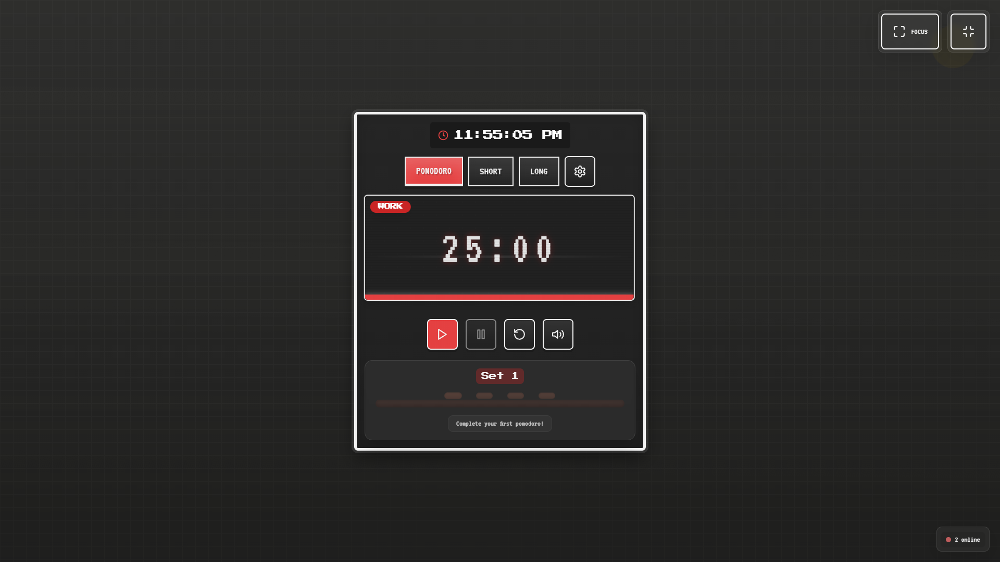

# 🍅 Pixel Pomodoro

<div align="center">


A retro-styled productivity timer with modern features and pixel-perfect UI design.

<p align="center">
  
  
  
</p>

</div>

## 🌟 Features

- 🎮 **Retro pixel art design** with modern UI elements
- 🔄 **Multiple timer modes** - Pomodoro, Short Break, Long Break
- 🎛️ **Customizable settings** for all timing intervals
- 🌱 **Visual progress** with growing tomato plants
- 🌙 **Focus mode** for distraction-free work
- 🔊 **Sound notifications** when timers complete
- 🎨 **Multiple themes** (Red, Blue, Green)
- 👥 **Live user counter** showing active users globally
- 📱 **Responsive design** from mobile to desktop

## 🚀 Live Demo

Experience the Pixel Pomodoro in action at [https://pomodoro-timer-alpha-gilt.vercel.app](https://pomodoro-timer-alpha-gilt.vercel.app)

<div align="center">
  
</div>

## 🔥 Live User Counter

The application features a real-time user counter showing how many people around the world are currently using Pixel Pomodoro. This creates a sense of global productivity community!

- The counter updates in real-time as users connect/disconnect
- Changes are animated with subtle visual feedback
- Status indicator changes color based on the currently selected theme

This feature is powered by Supabase Realtime and counts active users across all device types.

## 📦 One-Click Deployment

[](https://vercel.com/new/clone?repository-url=https%3A%2F%2Fgithub.com%2Fusername%2Fpomodoro-timer)

## 💻 Local Development

1. Clone the repository

   ```bash
   git clone https://github.com/username/pomodoro-timer.git
   cd pomodoro-timer
   ```

2. Install dependencies

   ```bash
   npm install
   ```

3. Set up environment variables

   Create a `.env.local` file based on `.env.example`

4. Start the development server

   ```bash
   npm run dev
   ```

5. Open [http://localhost:3000](http://localhost:3000) in your browser

## 🔧 Environment Variables

This project uses Supabase for the live user counter feature:

- `NEXT_PUBLIC_SUPABASE_URL`: Your Supabase project URL
- `NEXT_PUBLIC_SUPABASE_ANON_KEY`: Your Supabase anonymous API key

See the `setup-supabase.md` file for detailed setup instructions.

## 🧰 Technologies Used

- **Frontend**: Next.js, React, TypeScript, Tailwind CSS
- **Animation**: Framer Motion
- **Real-time**: Supabase Realtime
- **Deployment**: Vercel

## 📄 License

This project is licensed under the MIT License - see the LICENSE file for details.

## 🙏 Acknowledgements

- Pixel art inspiration from various retro games
- Sound effects created using [ZzFX](https://github.com/KilledByAPixel/ZzFX)
- Pixel font from [Google Fonts](https://fonts.google.com/)
